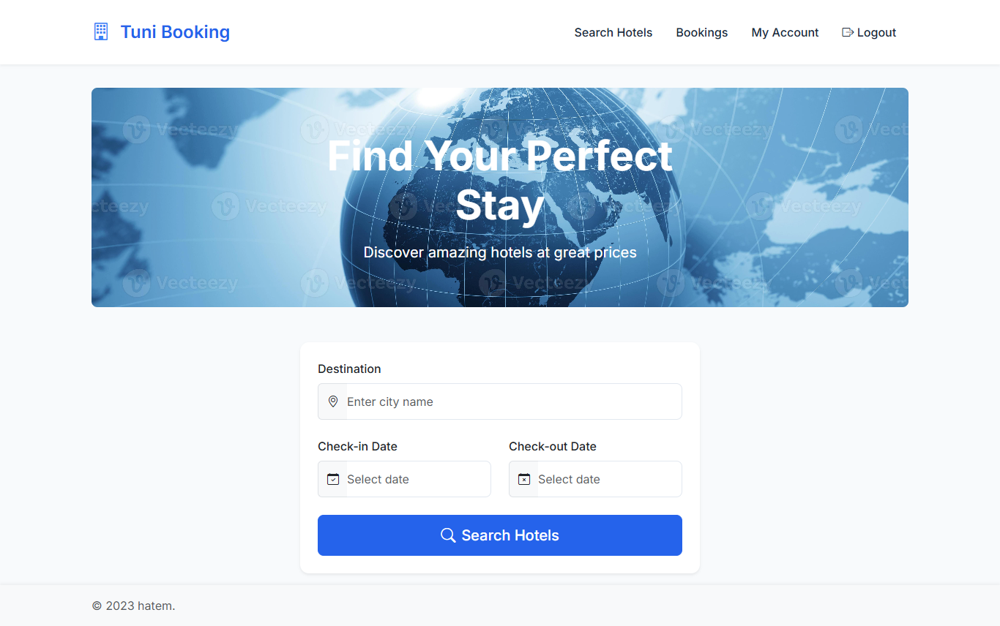
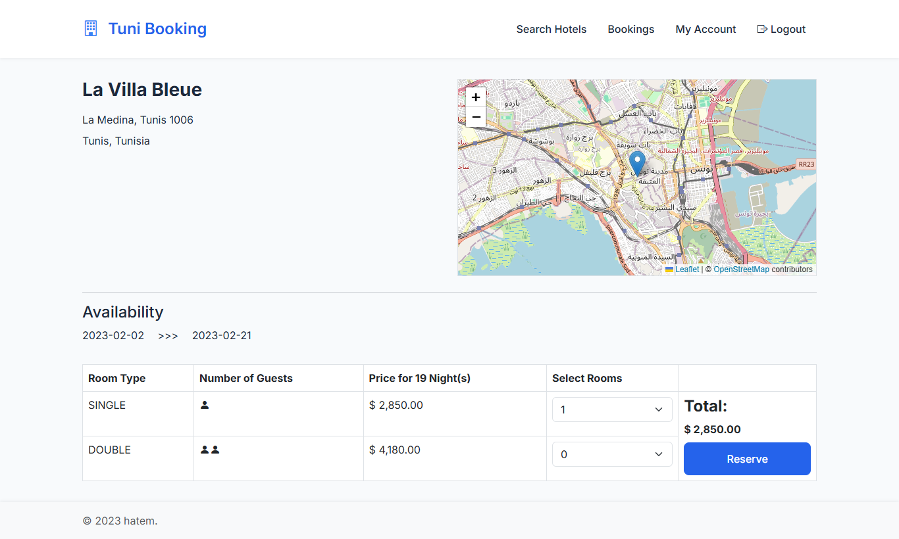
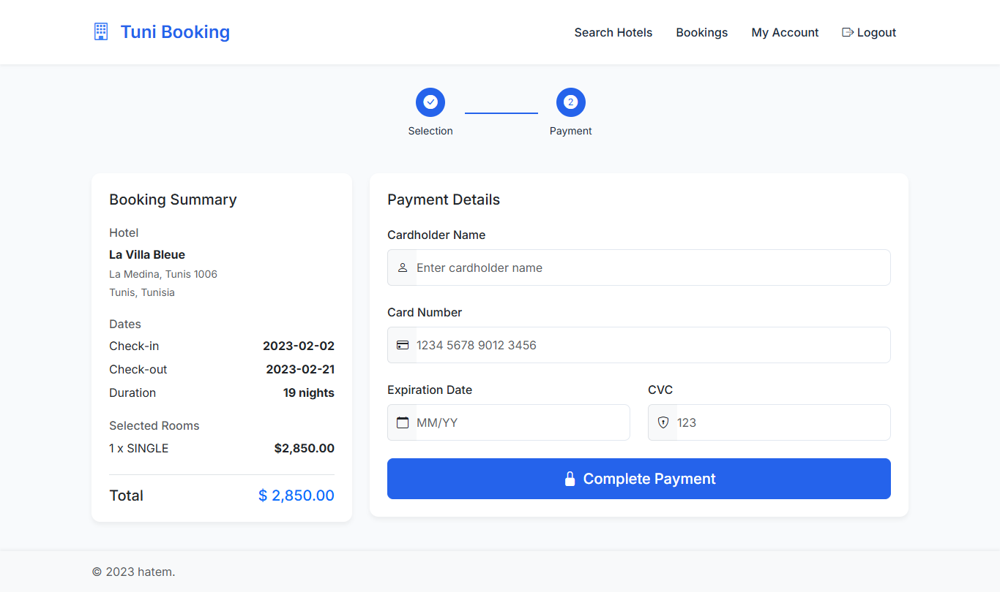
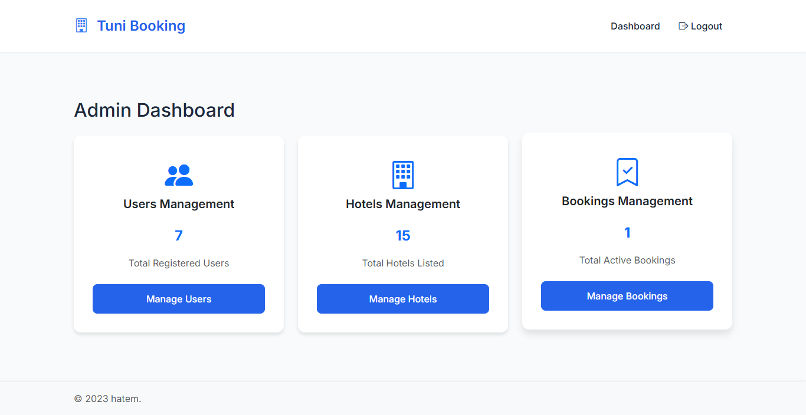

# Hotel Booking Application

A hotel booking app that connects travelers with accommodations, allowing hotel managers to list and manage their properties and customers to browse and book rooms.
## Demo Screenshots

*Homepage of the Hotel Booking Application*

### Customer Experience

*Hotel search interface with filtering options*

*Search results*

*Step-by-step booking process*

*Step-by-step booking process*

*Step-by-step booking process*

*Bookings list*

*User Profile*

*Edit Profile*

### Hotel Manager Experience

*Hotel manager dashboard with property statistics*

*Interface for managing hotel properties*

*Edit hotel properties*

*Add hotel properties*

*Booking management for hotel managers*

### Admin Experience

*Administrator dashboard with system overview*

*User list*

*Edit user*

*Hotel list*

## Features

- **User Management**
  - Account registration and login
  - Role-based authentication (Customer, Hotel Manager, Administrator)
  - Profile management

- **For Customers**
  - Search for hotels with available rooms
  - View hotel details and room information
  - Make reservations with date selection
  - Manage and view booking history
  - Payment processing

- **For Hotel Managers**
  - Manage hotel listings
  - Add and update room information
  - View and manage bookings
  - Dashboard with statistics

- **For Administrators**
  - Manage all hotels and users
  - System monitoring and reporting
  - Administrative dashboard

## Technology Stack

- **Backend**
  - Java 17
  - Spring Boot 3
  - Spring Security
  - Spring Data JPA
  - Hibernate

- **Frontend**
  - Thymeleaf
  - Bootstrap 5
  - HTML5/CSS3
  - JavaScript

- **Database**
  - MySQL

- **Build Tools**
  - Maven

## Usage

### For Customers

1. Register a new account or log in
2. Search for hotels based on location, dates, and preferences
3. View hotel details, room types, and pricing
4. Select rooms and proceed to booking
5. Complete the payment process
6. View your booking history and manage reservations

### For Hotel Managers

1. Register and verify as a hotel manager
2. Add your hotel(s) with detailed information
3. Manage room types, availability, and pricing
4. View incoming and confirmed bookings
5. Access the dashboard for performance statistics

### For Administrators

1. Log in with administrator credentials
2. Manage all hotels, rooms, and bookings
3. Handle user accounts and permissions
4. View system statistics and generate reports